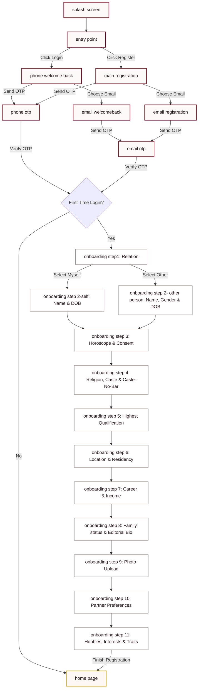

# KalyaThiru Flutter Mobile App Architecture & Flow Blueprint

This document serves as the master routing, state management, and architecture blueprint for migrating the 21 prototyped HTML/CSS screens of **KalyaThiru** (caste-free, high-trust Tamil matrimony) into a cross-platform Flutter (Dart) mobile application.

---

## 1. Design Tokens to Flutter ThemeData Mapping

To preserve the **Heritage & Kaapi** theme (Temple Maroon, Soft Ivory, and Antique Gold) in Flutter, we translate the CSS variables into a custom `ThemeData` configuration.

### Theme Palette Translation
*   **Primary (Temple Maroon):** `#800020` / `#570013` $\rightarrow$ `Color(0xFF800020)`
*   **Background (Soft Ivory / Sandalwood):** `#FDFBF7` $\rightarrow$ `Color(0xFFFDFBF7)`
*   **Surface:** `#FFFFFF` $\rightarrow$ `Color(0xFFFFFFFF)`
*   **Text (Deep Charcoal/Maroon Tint):** `#1D1B19` $\rightarrow$ `Color(0xFF1D1B19)`
*   **Muted (Secondary text/borders):** `#8A7973` $\rightarrow$ `Color(0xFF8A7973)`
*   **Accent (Antique Gold):** `#D4AF37` $\rightarrow$ `Color(0xFFD4AF37)`

### Gradients (Aura System)
*   **Aura Gold:**
    ```dart
    const LinearGradient auraGold = LinearGradient(
      colors: [
        Color(0xFFBF953F),
        Color(0xFFFCF6BA),
        Color(0xFFB38728),
        Color(0xFFFBF5B7),
        Color(0xFFAA771C),
      ],
      begin: Alignment.topLeft,
      end: Alignment.bottomRight,
    );
    ```
*   **Aura Silver:**
    ```dart
    const LinearGradient auraSilver = LinearGradient(
      colors: [
        Color(0xFFB5B5B5),
        Color(0xFFF5F5F5),
        Color(0xFF9E9E9E),
        Color(0xFFE0E0E0),
        Color(0xFF8A8A8A),
      ],
      begin: Alignment.topLeft,
      end: Alignment.bottomRight,
    );
    ```

### Flutter Theme Definition (`theme.dart`)
```dart
import 'package:flutter/material.dart';
import 'package:google_fonts/google_fonts.dart';

class KalyaThiruTheme {
  static const Color primaryMaroon = Color(0xFF800020);
  static const Color primaryDark = Color(0xFF570013);
  static const Color softIvory = Color(0xFFFDFBF7);
  static const Color darkCharcoal = Color(0xFF1D1B19);
  static const Color mutedGray = Color(0xFF8A7973);
  static const Color antiqueGold = Color(0xFFD4AF37);

  static ThemeData get lightTheme {
    return ThemeData(
      useMaterial3: true,
      brightness: Brightness.light,
      primaryColor: primaryMaroon,
      scaffoldBackgroundColor: softIvory,
      colorScheme: const ColorScheme.light(
        primary: primaryMaroon,
        secondary: antiqueGold,
        background: softIvory,
        surface: Colors.white,
        onPrimary: Colors.white,
        onSecondary: primaryDark,
        onBackground: darkCharcoal,
        onSurface: darkCharcoal,
      ),
      textTheme: TextTheme(
        // Serif titles
        displayLarge: GoogleFonts.sourceSerif4(
          fontSize: 48,
          fontWeight: FontWeight.bold,
          color: primaryMaroon,
        ),
        headlineLarge: GoogleFonts.sourceSerif4(
          fontSize: 32,
          fontWeight: FontWeight.w600,
          color: darkCharcoal,
        ),
        headlineMedium: GoogleFonts.sourceSerif4(
          fontSize: 24,
          fontWeight: FontWeight.w600,
          color: darkCharcoal,
        ),
        // Sans-serif body
        bodyLarge: GoogleFonts.nunitoSans(
          fontSize: 18,
          fontWeight: FontWeight.normal,
          color: darkCharcoal,
        ),
        bodyMedium: GoogleFonts.nunitoSans(
          fontSize: 16,
          fontWeight: FontWeight.normal,
          color: darkCharcoal,
        ),
        labelLarge: GoogleFonts.nunitoSans(
          fontSize: 14,
          fontWeight: FontWeight.bold,
          letterSpacing: 1.0,
          color: primaryMaroon,
        ),
      ),
      cardTheme: const CardTheme(
        color: Colors.white,
        elevation: 0,
        shape: RoundedRectangleBorder(
          side: BorderSide(color: Color(0x1B8C7071), width: 1),
          borderRadius: BorderRadius.all(Radius.circular(4)), // Sharp crisp borders
        ),
      ),
      inputDecorationTheme: InputDecorationTheme(
        filled: true,
        fillColor: Colors.transparent,
        contentPadding: const EdgeInsets.symmetric(horizontal: 16, vertical: 18),
        enabledBorder: OutlineInputBorder(
          borderSide: const BorderSide(color: Color(0xFF8C7071)),
          borderRadius: BorderRadius.circular(4),
        ),
        focusedBorder: OutlineInputBorder(
          borderSide: const BorderSide(color: primaryMaroon, width: 2),
          borderRadius: BorderRadius.circular(4),
        ),
        labelStyle: const TextStyle(color: mutedGray),
      ),
      elevatedButtonTheme: ElevatedButtonThemeData(
        style: ElevatedButton.styleFrom(
          backgroundColor: primaryMaroon,
          foregroundColor: Colors.white,
          elevation: 2,
          shadowColor: const Color(0x40570013),
          padding: const EdgeInsets.symmetric(vertical: 16, horizontal: 24),
          shape: RoundedRectangleBorder(
            borderRadius: BorderRadius.circular(4),
          ),
          textStyle: GoogleFonts.nunitoSans(
            fontWeight: FontWeight.bold,
            fontSize: 16,
            letterSpacing: 1.0,
          ),
        ),
      ),
    );
  }
}
```

---

## 2. Screen Catalog & Feature Analysis

We mapped the 21 directories in the workspace into logical functional groups matching their user journey motives.

### A. Authentication & Splash Group
1.  **`splash screen`**
    *   *Motive:* High-quality, premium branding impression.
    *   *Elements:* Animated golden mandala/temple icon, Tamil traditional visual cues.
2.  **`entry point`**
    *   *Motive:* Landing gateway.
    *   *CTAs:* "Register" $\rightarrow$ `main registration`, "Login" $\rightarrow$ `phone welcome back`.
3.  **`phone welcome back` / `email welcomeback`**
    *   *Motive:* User log in via phone or email.
    *   *Fields:* Phone Number or Email input.
    *   *CTAs:* "Login" $\rightarrow$ `phone otp` or `email otp`, Toggle login method.
4.  **`phone otp` / `email otp`**
    *   *Motive:* Secure passwordless OTP verification.
    *   *Fields:* 4/6 digit numeric pins.
    *   *CTAs:* "Verify" $\rightarrow$ Route dynamically (If onboarding complete $\rightarrow$ `home page`, else $\rightarrow$ last incomplete onboarding step).

### B. Onboarding Setup Group
5.  **`main registration` / `email registration`**
    *   *Motive:* User sign-up initialization.
    *   *Fields:* Phone number or primary email address.
    *   *CTAs:* Pushes to OTP screens and subsequently `onboarding step1`.
6.  **`onboarding step1`**
    *   *Motive:* Identify profile relation (caste-free approach starts here, focusing on the individual).
    *   *Fields:* Selection chips (Myself, Son, Daughter, Brother, Sister, Relative, Friend, Father, Mother).
    *   *Decision Branching:*
        *   If "Myself" $\rightarrow$ Route to `onboarding step 2-self`.
        *   If any other relation $\rightarrow$ Route to `onboarding step 2- other person` (which collects gender).
7.  **`onboarding step 2-self`**
    *   *Motive:* Personal details for account owner.
    *   *Fields:* First/Middle/Last Name, Date of Birth.
8.  **`onboarding step 2- other person`**
    *   *Motive:* Personal details for relative/ward.
    *   *Fields:* First/Middle/Last Name, Gender (Male/Female/Other), Date of Birth.
9.  **`onboarding step 3` (Placeholder)**
    *   *Motive:* Gender selector or basic horoscope preferences. Note: In the HTML files, this contains a screenshot but no code.html. We will implement it in Flutter to collect horoscope details/consent.
10. **`onboarding step 4`**
    *   *Motive:* Religion & Community (Highlighting "Caste No Bar").
    *   *Fields:* Religion dropdown, Caste dropdown (dynamically populated based on religion), "Caste No Bar" checkbox, Subcaste (optional), Dosham radio (Yes/No/None).
11. **`onboarding step 5`**
    *   *Motive:* Higher education verification credentials.
    *   *Fields:* Highest Qualification, University/Institution name, Year of Completion.
12. **`onboarding step 6`**
    *   *Motive:* Residential location info.
    *   *Fields:* Citizenship Status, Country, Living in since, State, City.
13. **`onboarding step 7`**
    *   *Motive:* Career and professional status.
    *   *Fields:* Employment Type, Occupation, Currency type, Annual Income.
14. **`onboarding step 8`**
    *   *Motive:* Family background & Editorial bio.
    *   *Fields:* Family Status, Family Wealth/Net Worth, "About Me" description (where Drop-caps are applied for editorial feel).
15. **`onboarding step 9`**
    *   *Motive:* Visual representation setup.
    *   *Fields:* Image selection/upload widget.
16. **`onboarding step 10`**
    *   *Motive:* Initial Match Preferences.
    *   *Fields:* Gothram preference, Star/Nakshatram preference, Family Wealth preference, Min/Max annual income preference.
17. **`onboarding step 11`**
    *   *Motive:* Lifestyle, hobbies, and traits.
    *   *Fields:* Hobbies multi-select chips (Reading, Music, Cooking, etc.), Bento-style Interest Cards (Tech, Art, Fashion, politics), Personality Traits (Introvert/Extrovert/Ambivert, Morning Person/Night Owl).

### C. Home Feed Group
18. **`home page`**
    *   *Motive:* High-trust profile feeds and premium offerings.
    *   *Key Components:*
        *   Profile Completeness Widget (e.g. 35%).
        *   Heritage Trust Elite promotion banner.
        *   Horizontal scrolling match items with "VERIFIED" trust seal badges.
        *   "Profiles You Viewed" activity tracker.
        *   "Photo Requests" component.
        *   "Who Viewed You" avatar stack.
        *   "Success Stories" testimonial bento card.
        *   Standard Bottom App Navigation Bar (Home, Matches, AI Search, Messages, Premium/Upgrade, Profile).

---

## 3. Comprehensive Navigation Flow

Below is the complete routing pathway that connects the screens, representing how data flows and how users transit.



---

## 4. State Management & Data Persistence Plan

Since onboarding is a multi-step workflow (11 steps) collecting a massive payload, the state must be **accumulated step-by-step** and **persisted locally** to prevent data loss if the app is closed or memory is reclaimed.

### A. Recommended Library Stack
1.  **State Management:** `flutter_bloc` (or `Riverpod` if preferred by the dev). We will use a cubit structure `OnboardingCubit` to manage step validation and temporary payloads.
2.  **Local Persistence:** `HydratedBloc` or `Hive` to save state changes to disk in real-time.
3.  **Dependency Injection:** `get_it` for registering data repositories.

### B. Onboarding State Architecture (`onboarding_state.dart`)
```dart
class OnboardingState {
  final int currentStep;
  final String? profileFor;
  final String? firstName;
  final String? middleName;
  final String? lastName;
  final String? gender;
  final DateTime? dob;
  final String? religion;
  final String? caste;
  final bool casteNoBar;
  final String? subcaste;
  final String? dosham;
  final String? qualification;
  final String? institution;
  final String? yearCompleted;
  final String? country;
  final String? state;
  final String? city;
  final String? employmentType;
  final String? occupation;
  final double? annualIncome;
  final String? familyStatus;
  final String? familyWealth;
  final String? bio;
  final String? photoPath;
  final List<String> hobbies;
  final List<String> interests;
  final String? trait;

  OnboardingState({
    this.currentStep = 1,
    this.profileFor,
    this.firstName,
    this.middleName,
    this.lastName,
    this.gender,
    this.dob,
    this.religion,
    this.caste,
    this.casteNoBar = false,
    this.subcaste,
    this.dosham = 'none',
    this.qualification,
    this.institution,
    this.yearCompleted,
    this.country,
    this.state,
    this.city,
    this.employmentType,
    this.occupation,
    this.annualIncome,
    this.familyStatus,
    this.familyWealth,
    this.bio,
    this.photoPath,
    this.hobbies = const [],
    this.interests = const [],
    this.trait,
  });

  OnboardingState copyWith({
    int? currentStep,
    String? profileFor,
    String? firstName,
    String? middleName,
    String? lastName,
    String? gender,
    DateTime? dob,
    String? religion,
    String? caste,
    bool? casteNoBar,
    String? subcaste,
    String? dosham,
    String? qualification,
    String? institution,
    String? yearCompleted,
    String? country,
    String? state,
    String? city,
    String? employmentType,
    String? occupation,
    double? annualIncome,
    String? familyStatus,
    String? familyWealth,
    String? bio,
    String? photoPath,
    List<String>? hobbies,
    List<String>? interests,
    String? trait,
  }) {
    return OnboardingState(
      currentStep: currentStep ?? this.currentStep,
      profileFor: profileFor ?? this.profileFor,
      firstName: firstName ?? this.firstName,
      middleName: middleName ?? this.middleName,
      lastName: lastName ?? this.lastName,
      gender: gender ?? this.gender,
      dob: dob ?? this.dob,
      religion: religion ?? this.religion,
      caste: caste ?? this.caste,
      casteNoBar: casteNoBar ?? this.casteNoBar,
      subcaste: subcaste ?? this.subcaste,
      dosham: dosham ?? this.dosham,
      qualification: qualification ?? this.qualification,
      institution: institution ?? this.institution,
      yearCompleted: yearCompleted ?? this.yearCompleted,
      country: country ?? this.country,
      state: state ?? this.state,
      city: city ?? this.city,
      employmentType: employmentType ?? this.employmentType,
      occupation: occupation ?? this.occupation,
      annualIncome: annualIncome ?? this.annualIncome,
      familyStatus: familyStatus ?? this.familyStatus,
      familyWealth: familyWealth ?? this.familyWealth,
      bio: bio ?? this.bio,
      photoPath: photoPath ?? this.photoPath,
      hobbies: hobbies ?? this.hobbies,
      interests: interests ?? this.interests,
      trait: trait ?? this.trait,
    );
  }
}
```

---

## 5. Next Steps for Flutter Migration

Here is how we will pair program to build and connect these pages:

1.  **Initialize Flutter App:** We will setup a standard Flutter layout with M3 enabled, importing the custom Google fonts (Lora and Nunito Sans) in `pubspec.yaml`.
2.  **Implement Design System:** Apply the `theme.dart` file as the global app theme.
3.  **Build Shared Components:**
    *   `RegalButton` (Maroon background, 4px border radius, golden click animation).
    *   `NotchedTextField` (A customized widget rendering input fields with borders and labels intersecting the border lines).
    *   `AuraContainer` (A container widget that applies the Gold Aura gradient or animating border).
4.  **Create Routing Engine:** Integrate `go_router` or use basic named routes containing the step logic.
5.  **Connect Pages sequentially:** As you build each screen, we will wire up the inputs to update the `OnboardingCubit` states and trigger validation (e.g., enabling the "Continue" buttons).
